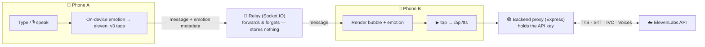

<div align="center">

# VoiceThread 🗣️

**A voice‑first messenger where every message is read aloud — in each contact's own voice, with the emotion it was written with.**

On‑device emotion detection → ElevenLabs `eleven_v3` emotion tags · dictate by voice (Scribe) · clone your own voice (IVC) · hands‑free reading.

    

</div>

---

## ✨ What makes it different

Most messengers show text. VoiceThread treats **voice + emotion as first‑class data**:

- 🎭 **Visible emotion metadata on every message.** Emotion is detected **on‑device** as you type, stored *with* the message, and shown in the bubble (emoji + label + intensity + the actual `[happy]`/`[sad]` audio tag). It drives an **accurate spoken replay** — the same message always sounds the same, in the right feeling.
- 🔊 **A real voice per contact.** Each conversation reads incoming messages aloud in that person's chosen ElevenLabs voice (`eleven_v3` for emotion, `flash` for speed).
- 🎙️ **Dictate by voice.** Tap the mic, speak, and ElevenLabs **Scribe** transcribes it (Polish + mixed languages) into a message.
- 🖐️ **Hands‑free mode.** Auto‑reads incoming messages aloud and lets you reply with one tap — built for eyes‑free use (e.g. driving).
- 🧬 **Clone your own voice.** Record ~40 s and ElevenLabs **Instant Voice Cloning** makes your messages sound like *you*. Gracefully degrades to premade voices on the free tier.
- 🔒 **Privacy by design.** Emotion is computed locally; the relay forwards messages and **stores nothing**; text reaches ElevenLabs only transiently to synthesize/transcribe.
- 🎨 **Looks like an ElevenLabs product.** Warm‑stone canvas, monochrome bubbles, Inter type, pastel emotion accents from the gradient‑orb palette.

> Built as a portfolio **proof‑of‑concept** to showcase the ElevenLabs platform end‑to‑end.

---

## 🎬 Demo

> _Add a short screen recording / screenshots here._
> Conversations list → open a chat → tap ▶ on a message (hear it with emotion) → 🎙 dictate a reply → **Mój głos** to clone your voice.

| Conversations | Chat (emotion metadata) | Voice studio (clone) |
|---|---|---|
| _screenshot_ | _screenshot_ | _screenshot_ |

---

## 🧠 How it works

Two phones, one small relay backend on a laptop, ElevenLabs for the heavy lifting:



- **Emotion is on‑device** (`voicethread-app/src/features/emotion/`) — pure, offline, multilingual rules (emoji, punctuation, CAPS, per‑language lexicons) → emotion + intensity → `eleven_v3` audio tags + voice settings. Stored as message metadata so replays are deterministic.
- **The relay never stores content** — it pairs two devices by a short room code and forwards payloads in memory.
- **The API key never leaves the server** — the app only ever talks to your backend, which proxies ElevenLabs.

---

## 🔌 ElevenLabs API showcase

Everything is proxied through `server.js` (key stays server‑side). Endpoints used:

| Capability | ElevenLabs API | Where |
|---|---|---|
| **Text‑to‑Speech** (emotion) | `POST /v1/text-to-speech/{id}` · `eleven_v3` with `[happy]`/`[sad]`… tags | reading messages, "Mów" |
| **TTS** (low latency / fallback) | `eleven_flash_v2_5` · `eleven_multilingual_v2` | per‑message playback |
| **Speech‑to‑Text** | `POST /v1/speech-to-text` · `scribe_v1` (`pl`, multilingual) | 🎙 dictation, hands‑free reply |
| **List voices** | `GET /v1/voices` (premade + your own) | voice pickers |
| **Instant Voice Cloning** | `POST /v1/voices/add` | "Mój głos" studio |

Server‑side niceties: response **caching** (`sha1(voice+model+format+settings+text)`), friendly **HTTP 402** when a free key hits a paid‑only feature (cloning / library voices), per‑socket **rate limiting**, and message‑size guards on the relay.

---

## 🆓 Works on the free tier?

Tested against a free ElevenLabs key — almost everything works (uses credits); only cloning needs a paid plan:

| Feature | Free tier |
|---|---|
| Read aloud **with emotion** (`eleven_v3`), `flash`, `multilingual` | ✅ |
| **Dictation** (Scribe STT) | ✅ |
| Premade voices, chat relay, hands‑free, history, full UI | ✅ |
| **Voice cloning** (IVC) | 💳 needs a paid plan (Starter+) — shows a friendly message otherwise |

---

## 📱 Features

Conversations list (last message, time, unread) · persistent on‑device history (SQLite) · per‑message emotion chip (emoji + label + intensity + tag) + pastel accent · voice playback per message with a mini‑waveform · 🎙 voice dictation · 🖐️ hands‑free auto‑read + speak‑to‑send · 🧬 voice cloning studio · per‑contact voices · timestamps + day separators · delivered/seen ticks · monochrome avatars · ElevenLabs‑inspired design system (Inter, tokens, gradient‑orb accents).

---

## 🛠️ Tech stack

- **App:** React Native + Expo (SDK 54), `expo-audio`, `expo-sqlite`, `socket.io-client`, Inter via `@expo-google-fonts`.
- **Backend:** Node.js + Express + Socket.IO — ElevenLabs proxy + in‑memory relay (Node 22 global `fetch`/`FormData`/`Blob`, zero heavy deps).
- **On‑device emotion:** pure JS, multilingual, deterministic.

---

## 🚀 Run it locally

**1) Backend**
```bash
cp .env.example .env        # then put your key in it:  ELEVENLABS_API_KEY=sk_...
npm install
npm start                   # http://localhost:3000
```

**2) App**
```bash
cd voicethread-app
npm install
npx expo start              # open in Expo Go (SDK 54) on your phone
```
The app auto‑detects the backend at your laptop's LAN IP on port `3000`, so keep the phone on the **same Wi‑Fi**. For two phones across networks, expose the backend with a tunnel (e.g. `cloudflared tunnel --url http://localhost:3000`).

**3) Try it**
- Open a chat → tap **▶** on a message to hear it with emotion.
- Tap **🎙** to dictate. Toggle **Bezdotykowo** for hands‑free.
- **🎙 Głos** (top of the list) → **Mój głos** → record → **Sklonuj** to clone your voice.

---

## 🧪 Tests

```bash
npm test         # backend relay + HTTP validation + on‑device emotion suite
```
Zero‑credit: tests never call ElevenLabs (the emotion engine and schema are pure functions; the relay is exercised against a local server).

---

## 🗂️ Project structure

```
.
├── server.js                     # Express + Socket.IO relay + ElevenLabs proxy + CONFIG
├── public/index.html             # original single‑file web prototype (where it started)
├── tests/                        # backend + relay tests
├── docs/                         # brand spec, messenger backlog, ADRs
└── voicethread-app/              # the Expo app
    └── src/
        ├── db/                   # SQLite schema + repository (local history)
        ├── features/
        │   ├── chat/             # ChatScreen, ConversationsScreen, useChat, voice input
        │   ├── emotion/          # on‑device emotion → eleven_v3 tags
        │   └── voice/            # voice‑cloning studio (IVC)
        ├── ui/                   # Wordmark, GradientOrb, Waveform
        └── theme.js              # ElevenLabs‑style design tokens
```

---

## ⚠️ Notes & limitations

- **Cloning needs a paid ElevenLabs plan** (IVC). On a free key the button shows a clear, friendly message and the app falls back to premade voices.
- **Fully no‑touch** hands‑free (wake on incoming, stop on silence) needs a **dev build** (`expo-speech-recognition` isn't in Expo Go). The one‑tap voice reply + auto‑read work in Expo Go.
- This is a student **proof‑of‑concept** (sideload / dev build), not a production app.

---

## 📄 License & disclaimer

MIT. **Independent project — not affiliated with or endorsed by ElevenLabs.** "ElevenLabs" and its brand belong to ElevenLabs; the UI takes visual inspiration from their design language purely for this showcase. Clone only voices you have the right to use.

<div align="center"><sub>Built with ❤️ and a lot of voices.</sub></div>
